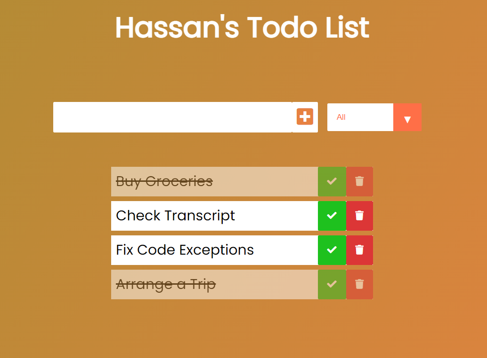

# Todo-List

A modern and simple todo list app built in HTML, CSS and JavaScript.

This Todo app will alow users to: \
&emsp;. Add new Tasks \
&emsp;. Remove Completed Tasks \
&emsp;. Store Tasks on Local Storage \
&emsp;. Modify Tasks located on Local Storage 

# Example of The User Interface

